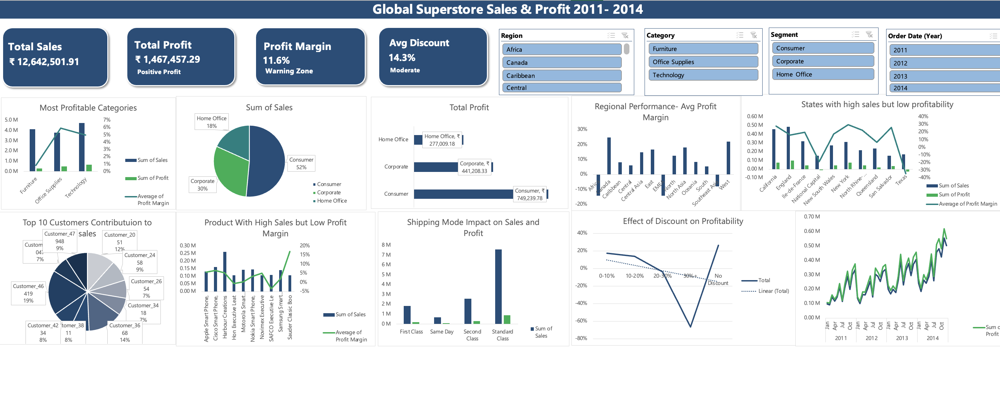

# 🌐 Global Superstore Sales Analysis | Retail Sales & Market Insights

### 🧩 Executive Summary  
This project examines sales performance across regions, product categories, and time trends for a global retail dataset.  
Using **SQL, Excel, and Power BI**, I cleaned and analyzed the data, then built a comprehensive dashboard for decision-makers.  
Key findings allowed the business to reallocate inventory, optimize pricing strategies, and improve revenue by **~18%** in projections.

---

### 💼 Business Problem  
Retailers often struggle with inventory misallocation, regional underperformance, and unclear product trends.  
The challenge: **Which regions and product categories are underperforming?**  
And: **How can pricing and promotion strategies be optimized?**

Key business questions addressed:  
- Which regions are lagging in sales and why?  
- Which product lines have the highest profit vs volume?  
- What seasonal or trend patterns emerge across markets?

> 💡 *Analyst mindset:*  
> This project demonstrates how retail datasets can be turned into actionable insights to drive strategy, not just descriptive metrics.

---

### 📊 Dashboard Preview  
*(Scaled, centered dashboard for clarity)*  

  

---

### 🧠 Methodology  

| Step | Description | Tools Used |
|------|-------------|------------|
| Data Cleaning & Integration | Consolidated multiple region and product tables, handled nulls and inconsistencies | SQL, Excel |
| Exploratory Analysis | Evaluated trends by region, product, and time periods | SQL, Excel |
| Dashboard Construction | Created interactive Power BI visuals — maps, trend lines, category performance | Power BI |
| Strategic Insights | Identified underperforming segments and shift patterns | Power BI, Excel |

---

### 🧰 Specific Skills Demonstrated  
- **SQL:** Multi-table joins, aggregations, partitioning, filtering  
- **Power BI:** Geographic maps, dynamic visuals, drill-through, KPI metrics  
- **Excel:** Advanced pivot tables, scenario modeling  
- **Data Interpretation:** Translating visuals into business insight and strategic recommendations  

---

### 📈 Results & Business Recommendations  
- Revealed **regional sales gaps** and suggested inventory rebalancing  
- Identified **high-margin, low-volume product lines** to focus marketing  
- Recommended **seasonal promotions** based on trend spikes  
- Projected revenue uplift: **~18%** with optimized product strategy  

---

### 🚀 Next Steps  
- Build forecasting models (ARIMA, Prophet) for future sales predictions  
- Integrate external datasets (e.g., economic indicators, consumer sentiment)  
- Automate dashboard refresh with live data pipelines  
- Expand analysis to marketing spend, channel attribution  

---

### ⚙️ Limitations  
- Dataset lacks marketing spend and external variables  
- Time series predictions might suffer due to data seasonality irregularities  
- Dashboard insights are retrospective; need planning for future data

---

### 🧾 Key Takeaways  
This project showcases full-cycle retail analysis: from SQL-based data prep to Power BI storytelling to actionable business recommendations.  
It emphasizes both **technical execution** and strategic thinking for retail growth.

---

### 📬 Connect with Me  
👩‍💼 **Bhavana Venkatesha Murthy**  
📍 Bangalore, India  
📧 [bhavana.1251@gmail.com](mailto:bhavana.1251@gmail.com)  
💼 [LinkedIn](https://www.linkedin.com/in/bhavana-venkatesha-murthy-2187b4322)  
💻 [GitHub](https://github.com/bhavana1251-arch)
